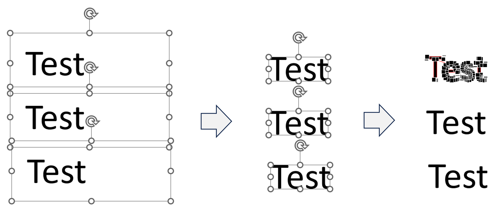

## Purpose of the script
This script converts one or more textboxes in PowerPoint into shapes.

## How to use:
1. Create a macro using the code in the source file.
2. Select one or more textbox.
3. Run the macro.

## Known alternatives to perform the same action:  
Create a shape that can cover the whole textbox and intersect the textbox with this shape (first click on the textbox to make it the primary shape). That's the process that's automated in this script.  
Cons: This manual process should be repeated as many times as there are textboxes.
